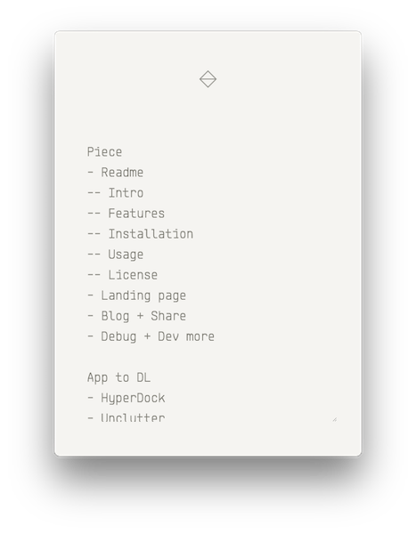

# Piece - Less equals More

A simple temporary-note app.

Now you could **list what you gonna do** the next day before you go to bed;

Or you could **write down some thoughts** temporarily while you are focusing on something else.

Hope you like it:)

## Features

- Floats on your windows. Reachable anytime
- Covering something you are working at? Just hide it
- Global shortcuts. Easy to control
- Simple and elegant user interface design

## Installation

- Mac OS X: [click here to download](https://github.com/PolarisChen/Piece/releases/download/v1.0.0/Piece-1.0.0.dmg)
- Linux: coming soon!
- Windows: coming soon!

## Usage

- Toggle float: <kbd>Alt-Shift-F</kbd>
- Toggle show: <kbd>Alt-Shift-S</kbd>

## License

MIT © 2016 Polaris Chen

Crafted with love by [Polaris](http://bus1996.me)